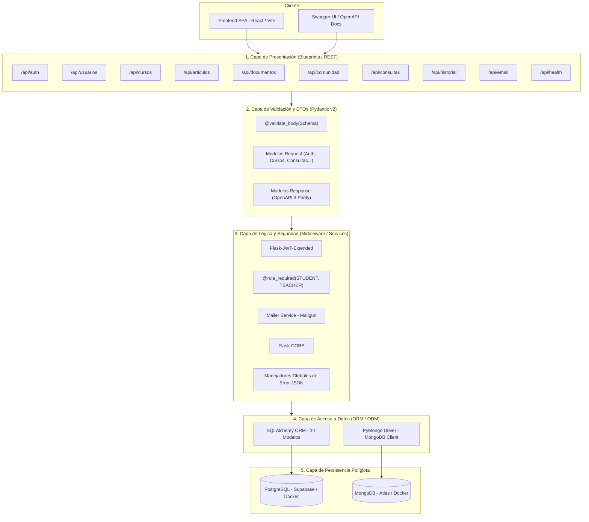
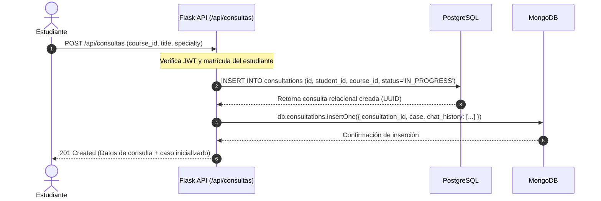
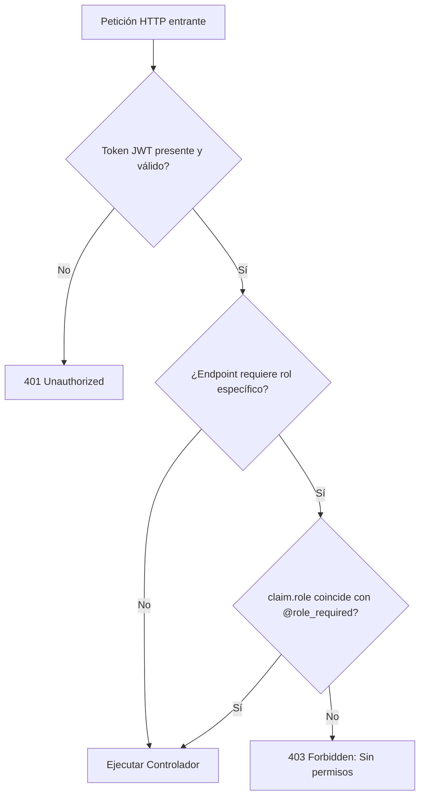
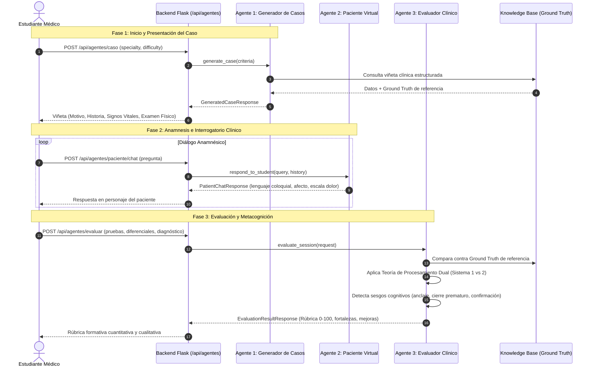

# Arquitectura del Backend — Clerkship / ClinicAI UNAB

Este documento detalla la arquitectura de software, el diseño modular, la estrategia de persistencia políglota y los estándares de seguridad implementados en el servicio backend (`flask-api`) de **Clerkship**.

---

## 1. Visión General y Principios de Diseño

El backend de Clerkship está diseñado como una **API REST modular** desarrollada en Python utilizando el framework **Flask**. Su propósito es gestionar la lógica de negocio académica, la autenticación segura, la gestión de cursos y biblioteca médica, y el ciclo de vida de las **simulaciones clínicas** para el entrenamiento del razonamiento diagnóstico.

### Principios Fundamentales:
* **Separación de Responsabilidades (SoC)**: Organización estricta por capas (rutas/controladores, modelos de datos, utilidades y configuración).
* **Modularidad desacoplada**: Uso extensivo de **Flask Blueprints**, permitiendo que cada dominio funcional opere de forma autónoma.
* **Persistencia Políglota**: Coexistencia coordinada entre una base de datos relacional (**PostgreSQL**) y una base de datos documental (**MongoDB**).
* **Seguridad por diseño**: Autenticación sin estado mediante **JWT (JSON Web Tokens)** y autorización basada en roles (**RBAC**).

---

## 2. Patrón Arquitectónico en Capas

El backend implementa el patrón **Application Factory (`create_app()`)** estructurado en cuatro capas lógicas:



### Descripción de Capas:

1. **Capa de Presentación (Rutas / Blueprints)**:
   - Recibe solicitudes HTTP (`GET`, `POST`, `PATCH`, `DELETE`).
   - Delega la validación de payloads y serialización de respuestas a la capa de esquemas.
   - Retorna respuestas homogéneas en formato `application/json` con los códigos de estado HTTP apropiados (`200`, `201`, `400`, `401`, `403`, `404`, `500`).

2. **Capa de Validación y DTOs (Pydantic v2 - `app/schemas/`)**:
   - Modela tipadamente cada petición entrante y respuesta saliente alineada 1:1 con la especificación OpenAPI 3.0.3.
   - Valida formatos (email, UUID, longitudes mínimas/máximas, expresiones regulares, enums de dominio) antes de que la petición ingrese a la lógica de negocio.
   - Proporciona el decorador `@validate_body` para interceptar datos no conformes devolviendo respuestas de error estándar `400 Bad Request`.

3. **Capa de Lógica y Seguridad**:
   - **Control de Acceso**: Validación de identidad con `@jwt_required()` e inspección de privilegios mediante `@role_required(*roles)`.
   - **Manejo de Errores Global**: Captura excepciones estándar (`400`, `404`, `405`, `500`) retornando estructuras JSON estandarizadas en lugar de HTML.
   - **Servicios Auxiliares**: Integración con Mailgun para envío de códigos de verificación y notificaciones.

3. **Capa de Acceso a Datos (ORM / ODM)**:
   - **SQLAlchemy 3.1**: Mapeo objeto-relacional tipado con modelos basados en clases, relaciones declarativas y métodos de serialización `to_dict()`.
   - **PyMongo 4.9**: Manejo de colecciones documentales con índices optimizados.

4. **Capa de Persistencia**:
   - Repositorio relacional ACID y repositorio NoSQL flexible.

---

## 3. Estrategia de Persistencia Políglota

El sistema utiliza un enfoque híbrido optimizado según la naturaleza de cada dato:

| Base de Datos | Motor | Entidades Gestionadas | Justificación Técnica |
|---|---|---|---|
| **Relacional** | **PostgreSQL 17** | `users`, `students`, `teachers`, `courses`, `student_courses`, `articles`, `article_tags`, `student_library`, `document_folders`, `consultations`, `ai_evaluations`, `community_posts`, `community_comments`, `community_likes` | Exige integridad referencial estricta, unicidad (correos, identificadores UUID), transacciones ACID y relaciones muchos a muchos. |
| **Documental** | **MongoDB 8.0** | `consultations` (viñetas clínicas, transcripción de chat y rúbricas IA), `documents` (archivos adjuntos e índices de búsqueda) | Estructuras de tamaño variable, historiales de conversación en orden cronológico, almacenamiento en base64 y esquemas evolutivos. |

### Patrón de Vinculación Postgres-Mongo:
Para las entidades compuestas (como una simulación clínica), **PostgreSQL almacena el registro relacional principal** (`consultations.id`, `student_id`, `course_id`, `status`, `score`), mientras que **MongoDB almacena el documento enriquecido** utilizando `consultation_id: UUID` como clave foránea lógica.



---

## 4. Catálogo Detallado de Blueprints y Módulos

El backend se organiza en **9 Blueprints modulares** registrados en `create_app()`:

| Blueprint | Prefijo de URL | Responsabilidad | Roles Permitidos | Modelos Principales |
|---|---|---|:---:|---|
| **`auth_bp`** | `/api/auth` | Registro de usuarios, verificación de correo, emisión y renovación de JWT, cambio de contraseña y avatar. | Público / Autenticado | `User`, `Student`, `Teacher` |
| **`usuarios_bp`** | `/api/usuarios` | Búsqueda por `@username`, consulta de perfiles públicos y edición de datos del usuario autenticado. | Todos (JWT) | `User` |
| **`cursos_bp`** | `/api/cursos` | Creación de cursos (docentes), catálogo general, listado de cursos matriculados y auto-matrícula (estudiantes). | `TEACHER` / `STUDENT` | `Course`, `StudentCourse` |
| **`articulos_bp`** | `/api/articulos` | Biblioteca digital de literatura médica, filtros por especialidad/etiquetas y gestión del estante personal. | `TEACHER` (creación) / `STUDENT` (estante) | `Article`, `ArticleTag`, `StudentLibrary` |
| **`documentos_bp`** | `/api/documentos` | Organización en carpetas con personalización de color y almacenamiento de documentos clínicos. | Todos (JWT) | `DocumentFolder`, Mongo `documents` |
| **`comunidad_bp`** | `/api/comunidad` | Foro académico estudiantil: publicaciones, comentarios jerárquicos y likes recíprocos. | Todos (JWT) | `CommunityPost`, `CommunityComment`, `CommunityLike` |
| **`consultas_bp`** | `/api/consultas` | Ciclo de vida de la simulación clínica: inicio de caso, conversación con el paciente virtual y cierre de sesión. | `STUDENT` / `TEACHER` (lectura) | `Consultation`, Mongo `consultations` |
| **`historial_bp`** | `/api/historial` | Trazabilidad de desempeño: casos completados, retroalimentación formativa de IA y métricas para el dashboard. | `STUDENT` / `TEACHER` | `Consultation`, `AiEvaluation` |
| **`email_bp`** | `/api/email` | Diagnóstico del servicio Mailgun y despacho de notificaciones asistidas. | Autenticado | `Config` |

---

## 5. Esquema de Seguridad y Control de Acceso (RBAC)

### Flujo de Tokens JWT:
* **Access Token**: Vida útil de **60 minutos**. Contiene la identidad (`user_id`) y el `role` en sus claims.
* **Refresh Token**: Vida útil de **30 días**. Permite emitir nuevos access tokens sin reingresar credenciales en `POST /api/auth/refresh`.



---

## 6. Estándar de Respuestas y Manejo de Errores

Para evitar la exposición de trazas internas o formatos HTML no estructurados, todos los endpoints capturan excepciones y devuelven el siguiente esquema estándar:

#### Formato de Error Estándar:
```json
{
  "error": "Not Found",
  "message": "El recurso solicitado no fue encontrado.",
  "status_code": 404
}
```

#### Endpoint de Salud del Sistema (`GET /api/health`):
```json
{
  "databases": {
    "mongodb": "connected",
    "postgresql": "connected"
  },
  "framework": "Flask",
  "service": "Clerkship Backend API",
  "status": "healthy",
  "version": "1.0.0"
}
```

---

## 7. Estructura de Directorios del Backend

```
backend/
├── ARQUITECTURA_BACKEND.md     # Documento maestro de arquitectura
├── GUIA_DE_USO.md              # Manual de despliegue y verificación
├── docker/
│   └── compose.yml             # Contenedores locales Postgres 17 y Mongo 8
├── database/
│   ├── postgres/init/          # 23 scripts DDL de inicialización relacional
│   └── mongo/init/             # Scripts JS de índices y colecciones
└── flask-api/
    ├── app.py                  # Entrypoint de ejecución
    ├── requirements.txt        # Dependencias de Python
    ├── .env.example            # Plantilla de variables de entorno
    └── app/
        ├── __init__.py         # Application Factory create_app()
        ├── config.py           # Objeto Config centralizado
        ├── utils.py            # Helpers get_current_user y @role_required
        ├── mailer.py           # Integración con Mailgun
        ├── email_templates.py  # Plantillas HTML de correo
        ├── schemas/            # Esquemas Request / Response con Pydantic v2
        │   ├── base.py         # BaseSchema, ErrorResponse, HealthResponse, @validate_body
        │   ├── auth.py         # Register, Login, VerifyEmail, Tokens
        │   ├── usuarios.py     # UserResponse, UserSummary, StorageUsage
        │   ├── cursos.py       # CreateCourse, CourseResponse
        │   ├── articulos.py    # CreateArticle, Shelf
        │   ├── documentos.py   # Folders y Files
        │   ├── comunidad.py    # Posts, Comments, Likes
        │   ├── consultas.py    # Simulation, ChatMessages
        │   ├── historial.py    # Feedback, Statistics
        │   ├── email.py        # SendNotification, EmailStatus
        │   └── agentes.py      # Case vignettes, Patient Chat, Evaluator rubric
        ├── services/           # Servicios de negocio y proveedores de IA
        │   └── agents/         # Subsistema de Agentes Cognitivos
        │       ├── base.py                 # Interfaces abstractas (ABC)
        │       ├── clinical_cases_data.py  # Dataset gastrointestinal y Ground Truth
        │       ├── mock_agents.py          # Implementaciones deterministas mock
        │       └── __init__.py             # Factory de proveedores (Mock / OpenAI / Gemini)
        ├── models/             # Modelos SQLAlchemy
        │   ├── user.py, student.py, teacher.py
        │   ├── course.py, student_course.py
        │   ├── article.py, article_tag.py, student_library.py
        │   ├── consultation.py, ai_evaluation.py
        │   ├── community_post.py, community_comment.py, community_like.py
        │   └── document_folder.py
        └── routes/             # Blueprints de la API
            ├── auth.py
            ├── usuarios.py
            ├── cursos.py
            ├── articulos.py
            ├── documentos.py
            ├── comunidad.py
            ├── consultas.py
            ├── historial.py
            ├── agentes.py      # Endpoints de los 3 Agentes de IA
            ├── docs.py
            └── email.py
    └── tests/                  # Suite automatizada de pruebas (Pytest)
        ├── conftest.py
        ├── test_contract_spec.py
        ├── test_contract_coverage.py
        ├── test_contract_schemas.py
        ├── test_schemas.py
        ├── test_endpoints_structure.py
        └── test_ai_agents.py   # Pruebas integrales de agentes y sesgos cognitivos
```

---

## 8. Arquitectura del Subsistema de Agentes de IA (ClinicAI UNAB)

El núcleo pedagógico de Clerkship reside en su subsistema de **Agentes de Inteligencia Artificial Cognitiva**, diseñado para emular la interacción clínica y evaluar formativamente el razonamiento diagnóstico en estudiantes de medicina.



### 8.1 Los Tres Agentes Especializados

1. **Agente 1 — Generador / Presentador de Casos Clínicos (`/api/agentes/caso`)**:
   - Genera viñetas estructuradas que cubren: datos demográficos, motivo de consulta, enfermedad actual, antecedentes personales y familiares, signos vitales y examen físico por sistemas.
   - Preserva de forma segura el **Ground Truth** (diagnóstico estándar de oro, paraclínicos indispensables, diferenciales aceptables y resumen fisiopatológico).
   - Especialización inicial en patologías gastrointestinales: *Pancreatitis Aguda Litiásica*, *Apendicitis Aguda*, *HDA por Úlcera Péptica* y *Colecistitis Aguda*.

2. **Agente 2 — Paciente Virtual Estandarizado (`/api/agentes/paciente/chat` y `/api/consultas/<id>/mensajes`)**:
   - Asume el rol del paciente en primera persona con modismos y expresiones coloquiales realistas en español latinoamericano.
   - Responde consistentemente a preguntas de dolor (localización, irradiación, intensidad, tipo), cronología, factores agravantes/atenuantes, síntomas asociados, hábitos y antecedentes.
   - Refleja estado emocional dinámico (`ansioso`, `quejumbrosa`, `somnoliento`) y dolor en escala de 1 a 10.

3. **Agente 3 — Tutor Evaluador de Razonamiento Clínico (`/api/agentes/evaluar`)**:
   - **Rúbrica Cuantitativa por Dominios (0 a 100)**:
     - *Anamnesis*: Calidad, completitud y sistematicidad del interrogatorio.
     - *Exámenes Diagnósticos*: Pertinencia y costo-efectividad de los paraclínicos solicitados frente a las guías de práctica clínica.
     - *Hipótesis Diferenciales*: Amplitud del diagnóstico diferencial planteado.
     - *Diagnóstico Final*: Acierto frente al estándar de oro.
   - **Detección de Sesgos Cognitivos (Teoría de Procesamiento Dual)**:
     - *Sesgo de Anclaje*: Fijación en la impresión inicial sin considerar alternativas plausibles.
     - *Cierre Prematuro*: Conclusión precipitada sin indagar suficientes datos anamnésicos o paraclínicos esenciales.
     - *Sesgo de Confirmación*: Solicitud selectiva de pruebas exclusivamente orientadas a ratificar una única sospecha preconcebida.
   - **Retroalimentación Formativa**: Resumen cualitativo, fortalezas y áreas prioritarias de mejora para cultivar el razonamiento analítico (Sistema 2).

### 8.2 Patrón de Diseño Proveedor / Adaptador (Provider-Agnostic)

La arquitectura desacopla estrictamente los endpoints HTTP y las interfaces de servicio (`BaseCaseGeneratorAgent`, `BaseVirtualPatientAgent`, `BaseClinicalEvaluatorAgent`) de las implementaciones subyacentes:
- **Fase Actual (Mock Providers)**: Implementación determinista de alta fidelidad clínica con base de conocimiento estructurada y cobertura de pruebas unitarias al 100%.
- **Transición a Modelos Comerciales (OpenAI / Gemini)**: Mediante la variable de entorno `AI_AGENT_PROVIDER` (`mock`, `gemini`, `openai`), la capa `app/services/agents/` permite conectar los SDKs oficiales de LLM comerciales sin modificar una sola línea de código en las rutas, esquemas ni frontend.

