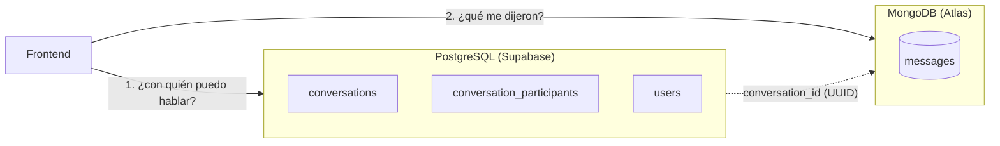
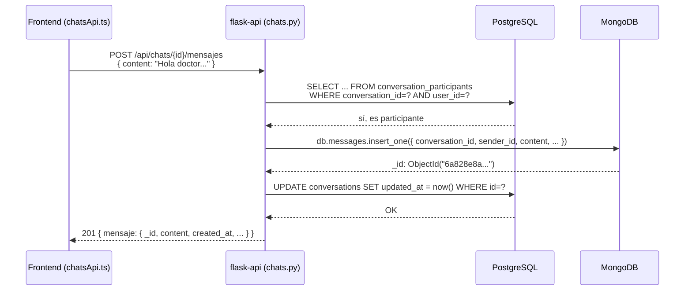
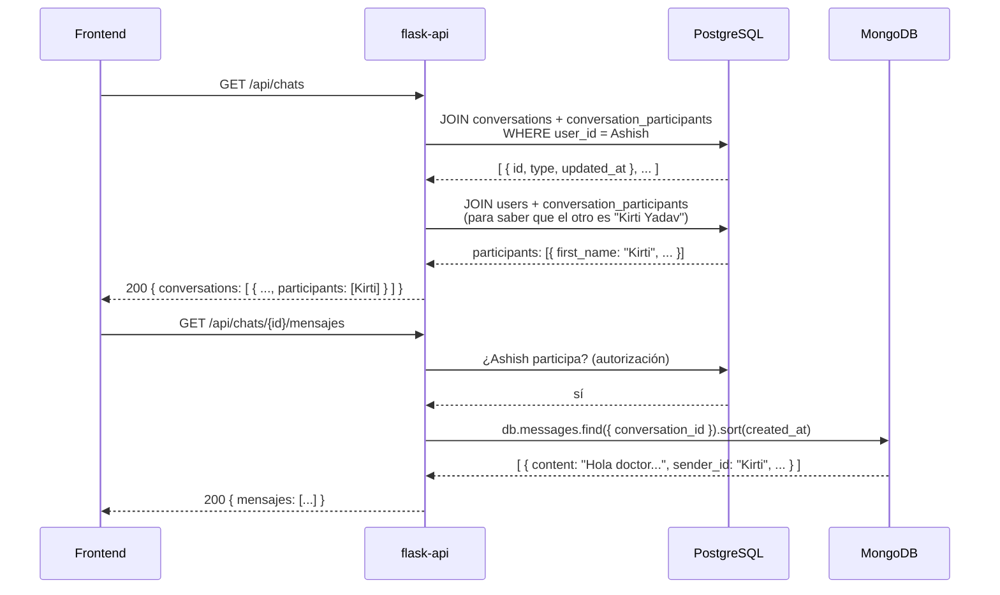

# Cómo funciona Chats por dentro — PostgreSQL + MongoDB explicado con código

> Este documento explica, línea por línea, cómo `flask-api` usa **dos bases de datos a la vez** para que Chats funcione: PostgreSQL (Supabase) para quién habla con quién, y MongoDB (Atlas) para el contenido de los mensajes. Todo el código citado aquí es el código real que ya está corriendo en `pruebas/back/flask-api/`.

## 1. La idea central: dos bases, una por cada tipo de dato

Un chat tiene dos tipos de información muy distintos:

| Pregunta                                                                | ¿Dónde vive?   | ¿Por qué ahí?                                                                                                                                                                                                                                                                                             |
| ----------------------------------------------------------------------- | -------------- | --------------------------------------------------------------------------------------------------------------------------------------------------------------------------------------------------------------------------------------------------------------------------------------------------------- |
| ¿Quién participa en esta conversación? ¿Es directa, de grupo o pública? | **PostgreSQL** | Es un dato **estructurado y pequeño**: un puñado de filas fijas por conversación. Postgres es bueno para relaciones (`JOIN` entre `conversations` y `users`) y para consultas exactas ("dame las conversaciones donde yo participo").                                                                     |
| ¿Qué se dijeron, en qué orden, con qué adjuntos?                        | **MongoDB**    | Es un dato **de forma variable y potencialmente enorme**: una conversación activa puede acumular miles de mensajes, cada uno con campos distintos (texto, archivo, nota de voz). Mongo no obliga a un esquema rígido y escala mejor para "muchísimos documentos pequeños que se insertan todo el tiempo". |



La conexión entre las dos bases es un solo campo: **`conversation_id`**. Es un UUID que existe como fila real en Postgres (`conversations.id`) y que se guarda como texto plano dentro de cada documento de Mongo (`messages.conversation_id`). No hay ninguna relación mágica automática — el código de `chats.py` es el que, a mano, usa ese mismo valor para preguntarle a las dos bases por separado.

## 2. Cómo `flask-api` se conecta a las dos bases al mismo tiempo

### 2.1. Las credenciales — `app/config.py`

```python
import os
from dotenv import load_dotenv

load_dotenv()

class Config:
    SQLALCHEMY_DATABASE_URI = os.environ.get("DATABASE_URL")       # Postgres
    SQLALCHEMY_TRACK_MODIFICATIONS = False

    MONGODB_URI = os.environ.get("MONGODB_URI")                    # Mongo
    MONGODB_DB_NAME = os.environ.get("MONGODB_DB_NAME")
    ...
```

Dos variables de entorno completamente independientes. `DATABASE_URL` es la cadena de conexión de Supabase (`postgresql+psycopg2://...`), `MONGODB_URI` es la de Atlas (`mongodb+srv://...`). Cada una tiene su propio driver de Python: **psycopg2** para Postgres, **pymongo** para Mongo. No comparten nada a este nivel.

### 2.2. Inicializar los dos clientes — `app/__init__.py`

```python
from flask import Flask
from flask_sqlalchemy import SQLAlchemy
from pymongo import MongoClient
from app.config import Config

db = SQLAlchemy()                    # ← cliente de Postgres (ORM)
mongo_client: MongoClient | None = None    # ← cliente de Mongo (driver directo)


def get_mongo_db():
    """Handle de la base de Mongo (colecciones consultations, messages)."""
    return mongo_client[Config.MONGODB_DB_NAME]


def create_app():
    global mongo_client

    app = Flask(__name__)
    app.config.from_object(Config)

    db.init_app(app)                              # conecta Postgres a esta app Flask
    ...

    if mongo_client is None and app.config["MONGODB_URI"]:
        mongo_client = MongoClient(app.config["MONGODB_URI"])   # conecta Mongo, una sola vez

    from app.routes.chats import chats_bp
    app.register_blueprint(chats_bp, url_prefix="/api/chats")
    ...
```

Dos patrones distintos, a propósito:

- **Postgres usa SQLAlchemy** (`db = SQLAlchemy()`): un **ORM** — se trabaja con clases Python (`Conversation`, `User`) en vez de escribir SQL a mano. `db.init_app(app)` la conecta a la configuración de Flask.
- **Mongo usa el driver `pymongo` directo**, sin ORM: `MongoClient(uri)` abre la conexión una sola vez al arrancar la app (por eso `mongo_client` es una variable global fuera de `create_app()` — así no se reconecta en cada petición), y `get_mongo_db()` es la función que cualquier archivo de rutas llama para obtener el objeto de la base y trabajar con sus colecciones (`get_mongo_db().messages`, por ejemplo).

Ambos quedan disponibles para importar desde cualquier archivo de rutas: `from app import db, get_mongo_db`.

## 3. El lado de Postgres: las tablas y los modelos

### 3.1. Las tablas (SQL real, `pruebas/db/postgresql/13-conversations.sql` y `14-conversation_participants.sql`)

```sql
CREATE TABLE conversations (
    id UUID PRIMARY KEY DEFAULT uuid_generate_v4(),
    type conversation_type NOT NULL,   -- 'DIRECT' | 'GROUP' | 'PUBLIC'
    name VARCHAR(150),
    course_id UUID,
    ai_agent_id UUID,
    created_at TIMESTAMP NOT NULL DEFAULT CURRENT_TIMESTAMP,
    updated_at TIMESTAMP NOT NULL DEFAULT CURRENT_TIMESTAMP,
    ...
);

CREATE TABLE conversation_participants (
    conversation_id UUID NOT NULL,
    user_id UUID NOT NULL,
    joined_at TIMESTAMP NOT NULL DEFAULT CURRENT_TIMESTAMP,
    last_read_at TIMESTAMP,
    PRIMARY KEY (conversation_id, user_id),
    ...
);
```

`conversations` es la conversación en sí (metadata). `conversation_participants` es una tabla puente: **quién** está en **qué** conversación — un usuario puede estar en muchas conversaciones, y una conversación tiene muchos usuarios (relación muchos-a-muchos clásica).

### 3.2. Los modelos SQLAlchemy (código Python que representa esas tablas)

`app/models/conversation.py`:
```python
class Conversation(db.Model):
    __tablename__ = "conversations"

    id = db.Column(UUID(as_uuid=True), primary_key=True, server_default=db.text("uuid_generate_v4()"))
    type = db.Column(db.Enum(*CONVERSATION_TYPES, name="conversation_type", create_type=False), nullable=False)
    name = db.Column(db.String(150))
    course_id = db.Column(UUID(as_uuid=True), db.ForeignKey("courses.id", ondelete="SET NULL"))
    ai_agent_id = db.Column(UUID(as_uuid=True), db.ForeignKey("ai_agents.id", ondelete="SET NULL"))
    created_at = db.Column(db.DateTime, server_default=func.now())
    updated_at = db.Column(db.DateTime, server_default=func.now())

    def to_dict(self):
        return {
            "id": str(self.id), "type": self.type, "name": self.name,
            "course_id": str(self.course_id) if self.course_id else None,
            "ai_agent_id": str(self.ai_agent_id) if self.ai_agent_id else None,
            "updated_at": self.updated_at.isoformat() if self.updated_at else None,
        }
```

`app/models/conversation_participant.py`:
```python
class ConversationParticipant(db.Model):
    __tablename__ = "conversation_participants"

    conversation_id = db.Column(UUID(as_uuid=True), db.ForeignKey("conversations.id", ondelete="CASCADE"), primary_key=True)
    user_id = db.Column(UUID(as_uuid=True), db.ForeignKey("users.id", ondelete="CASCADE"), primary_key=True)
    joined_at = db.Column(db.DateTime, server_default=func.now())
    last_read_at = db.Column(db.DateTime)
```

Cada clase = una tabla. Cada atributo (`db.Column(...)`) = una columna. `to_dict()` es el método que convierte la fila (un objeto Python) en un diccionario, para poder devolverla como JSON al frontend — Postgres no sabe nada de JSON, eso es responsabilidad del backend.

## 4. El lado de Mongo: la colección `messages`

No hay "modelo" ni esquema fijo — Mongo no lo exige. La forma del documento la define el propio código que inserta (`enviar_mensaje`, abajo). Cada mensaje se ve así:

```jsonc
{
  "_id": ObjectId("..."),                 // lo genera Mongo solo
  "conversation_id": "aa9984a7-...",      // el UUID de Postgres, como texto
  "sender_type": "student",               // "student" | "teacher"
  "sender_id": "464f98ba-...",            // el UUID del usuario que lo mandó
  "content": "Hola doctor, una consulta...",
  "file_attachment": null,                // o { name, sizeStr, type }
  "audio_duration": null,                 // o "0:23"
  "created_at": ISODate("2026-08-17T04:31:06Z")
}
```

Tiene dos índices (creados en `pruebas/db/mongodb/02-messages.js` / `apply_indexes.py`): uno compuesto en `(conversation_id, created_at)` — para traer los mensajes de una conversación ya ordenados por fecha sin que Mongo tenga que revisar toda la colección — y uno en `sender_type`.

## 5. Los endpoints, explicados línea por línea

Todos viven en `app/routes/chats.py`, montados bajo `/api/chats` (ver `url_prefix="/api/chats"` en `__init__.py`).

> Nota: además de los 4 endpoints de abajo (Postgres + Mongo), existen `POST` y `GET /api/chats/<id>/typing` para el indicador de "está escribiendo". Esos dos **no tocan ninguna de las dos bases** — es un estado efímero en un diccionario en memoria del propio proceso de Flask (`_typing_state`), con expiración de 4 segundos. Es intencional: guardarlo en Postgres o Mongo sería carísimo (escribiría en disco por cada tecla) para un dato que solo importa por unos segundos. La limitación es que se resetea si el servidor se reinicia y no se comparte entre varios workers — para producción real con más de un proceso, eso pasaría a vivir en Redis.

### 5.1. `GET /api/chats` — listar mis conversaciones (**Postgres para el "quién", Mongo para el último mensaje**)

```python
@chats_bp.get("")
@jwt_required()
def listar():
    user = get_current_user()
    rows = (
        Conversation.query.join(
            ConversationParticipant, ConversationParticipant.conversation_id == Conversation.id
        )
        .filter(ConversationParticipant.user_id == user.id)
        .order_by(Conversation.updated_at.desc())
        .all()
    )

    last_by_conv = _last_messages_by_conversation([str(c.id) for c in rows])

    conversations = []
    for c in rows:
        d = _conversation_dict_with_participants(c, user.id)
        d["last_message"] = _last_message_preview(last_by_conv.get(str(c.id)))
        conversations.append(d)

    return jsonify({"conversations": conversations}), 200
```

- `@jwt_required()`: antes de ejecutar nada, Flask-JWT-Extended verifica el `Authorization: Bearer <token>` del pedido. Si no es válido, corta con `401` automáticamente.
- `get_current_user()`: lee el `user_id` que va dentro del JWT y busca esa fila en `users` (Postgres).
- `Conversation.query.join(ConversationParticipant, ...)`: esto es SQLAlchemy generando un **`INNER JOIN`** en SQL real. Traducido a SQL puro, esta consulta es:
  ```sql
  SELECT conversations.*
  FROM conversations
  JOIN conversation_participants
    ON conversation_participants.conversation_id = conversations.id
  WHERE conversation_participants.user_id = :mi_id
  ORDER BY conversations.updated_at DESC;
  ```

La parte de "¿cómo le muestro al frontend el nombre de la otra persona, no un UUID?" la resuelve `_conversation_dict_with_participants`:

```python
def _conversation_dict_with_participants(conversation: Conversation, exclude_user_id) -> dict:
    rows = (
        db.session.query(User, ConversationParticipant.last_read_at)
        .join(ConversationParticipant, ConversationParticipant.user_id == User.id)
        .filter(
            ConversationParticipant.conversation_id == conversation.id,
            User.id != exclude_user_id,
        )
        .all()
    )
    participants = []
    for u, last_read_at in rows:
        p = u.to_dict()
        p["last_read_at"] = last_read_at.isoformat() if last_read_at else None
        participants.append(p)
    return {**conversation.to_dict(), "participants": participants}
```

Por cada conversación, hace **otro** `JOIN` — esta vez entre `users` y `conversation_participants` — para traer los datos de **todos los participantes menos yo mismo** (`User.id != exclude_user_id`), incluyendo su `last_read_at` (cuándo fue la última vez que ese participante pidió los mensajes — ver el chulo de "leído" en el punto 5.3). Así, si estoy en un chat DIRECT con la Dra. Rostova, el frontend recibe su `first_name`/`last_name` reales, no un ID sin sentido.

**Lo nuevo — la vista previa del último mensaje.** Antes este endpoint era 100% Postgres. Ahora, para que la lista de chats muestre "Hola, ¿tienes un minuto?" en vez del cargo del otro participante, hace falta preguntarle a Mongo por el último mensaje de **cada** conversación — pero preguntar una por una sería lento (una consulta a Mongo por cada fila de la lista). En su lugar, se hace **una sola consulta agregada** que resuelve todas de una vez:

```python
def _last_messages_by_conversation(conversation_ids: list[str]) -> dict:
    if not conversation_ids:
        return {}
    pipeline = [
        {"$match": {"conversation_id": {"$in": conversation_ids}}},
        {"$sort": {"created_at": -1}},
        {"$group": {
            "_id": "$conversation_id",
            "content": {"$first": "$content"},
            "audio": {"$first": "$audio"},
            "file_attachment": {"$first": "$file_attachment"},
            "sender_id": {"$first": "$sender_id"},
            "created_at": {"$first": "$created_at"},
        }},
    ]
    return {doc["_id"]: doc for doc in get_mongo_db().messages.aggregate(pipeline)}
```

Traducido: "de todos los mensajes de estas conversaciones, ordénalos del más nuevo al más viejo, y agrúpalos por `conversation_id` quedándote solo con el primero de cada grupo" — el equivalente en Mongo de un `SELECT DISTINCT ON` de Postgres. `_last_message_preview()` convierte ese documento crudo en algo mostrable: `"🎤 Nota de voz"` si tiene audio, `"📎 nombre-archivo"` si tiene adjunto, o el texto tal cual.

### 5.2. `POST /api/chats` — crear una conversación (**Postgres, con una regla de negocio extra**)

```python
@chats_bp.post("")
@jwt_required()
def crear():
    user = get_current_user()
    data = request.get_json(silent=True) or {}

    conv_type = (data.get("type") or "").strip().upper()
    ...
    participant_ids = {uuid.UUID(pid) for pid in data.get("participant_ids", [])}
    participant_ids.add(user.id)   # yo también soy participante

    if conv_type == "DIRECT" and len(participant_ids) == 2:
        other_id = next(pid for pid in participant_ids if pid != user.id)
        existing = (
            Conversation.query.join(ConversationParticipant, ...)
            .filter(Conversation.type == "DIRECT", ConversationParticipant.user_id.in_([user.id, other_id]))
            .group_by(Conversation.id)
            .having(db.func.count(ConversationParticipant.user_id) == 2)
            .first()
        )
        if existing is not None:
            return jsonify({"conversation": _conversation_dict_with_participants(existing, user.id)}), 200

    conversation = Conversation(type=conv_type, name=data.get("name"), ...)
    db.session.add(conversation)
    db.session.flush()   # ← aquí Postgres genera el UUID (uuid_generate_v4()) y SQLAlchemy lo lee de vuelta

    for participant_id in participant_ids:
        db.session.add(ConversationParticipant(conversation_id=conversation.id, user_id=participant_id))

    db.session.commit()
    return jsonify({"conversation": _conversation_dict_with_participants(conversation, user.id)}), 201
```

Puntos clave:
- **Antes de crear nada**, si es tipo `DIRECT` (chat 1-a-1), busca si ya existe una conversación DIRECT entre exactamente esas dos personas (`.having(count == 2)`) — si existe, la reutiliza y devuelve `200` en vez de duplicar. Esto evita que cada vez que le des "+" para hablar con la misma persona se cree un chat nuevo vacío.
- `db.session.add(conversation)` + `db.session.flush()`: `add` solo la pone en la "cola" de cambios pendientes de SQLAlchemy; `flush()` es lo que realmente manda el `INSERT` a Postgres **sin cerrar la transacción todavía** — se hace así para poder leer `conversation.id` (que Postgres generó) y usarlo inmediatamente después, al crear las filas de `conversation_participants`.
- `db.session.commit()`: recién acá se confirma todo de una — la conversación Y sus participantes se guardan juntos, o ninguno de los dos si algo falla a mitad de camino (eso es una transacción).
- **Tampoco se toca Mongo acá.** Crear una conversación es puro Postgres; los mensajes todavía no existen.

### 5.3. `GET /api/chats/<id>/mensajes` — leer los mensajes (**Postgres autoriza y marca "leído"; Mongo trae los datos**)

```python
@chats_bp.get("/<conversation_id>/mensajes")
@jwt_required()
def listar_mensajes(conversation_id):
    user = get_current_user()
    if not _is_participant(conversation_id, user.id):          # ← chequeo en Postgres
        return jsonify({"error": "No perteneces a esta conversación"}), 403

    limit = min(int(request.args.get("limit", 50)), 200)
    mensajes = list(
        get_mongo_db()                                          # ← consulta en Mongo
        .messages.find({"conversation_id": conversation_id})
        .sort("created_at", -1)
        .limit(limit)
    )
    mensajes.reverse()
    for m in mensajes:
        m["_id"] = str(m["_id"])   # ObjectId no es serializable a JSON tal cual, hay que convertirlo a texto

    # Marca que ESTE usuario vio los mensajes hasta ahora — de vuelta a Postgres.
    participant = ConversationParticipant.query.filter_by(
        conversation_id=conversation_id, user_id=user.id
    ).first()
    if participant is not None:
        participant.last_read_at = datetime.now(timezone.utc)
        db.session.commit()

    return jsonify({"mensajes": mensajes}), 200
```

Este es el endpoint donde **las dos bases trabajan juntas, en tres pasos, en el mismo request**:

1. **Paso 1 — Postgres decide si tienes permiso.** `_is_participant()`:
   ```python
   def _is_participant(conversation_id, user_id) -> bool:
       return ConversationParticipant.query.filter_by(
           conversation_id=conversation_id, user_id=user_id
       ).first() is not None
   ```
   Traducido: `SELECT 1 FROM conversation_participants WHERE conversation_id = :id AND user_id = :yo LIMIT 1`. Si no soy participante de esa conversación, **ni siquiera se llega a tocar Mongo** — se corta con `403` de una vez. Esta es la razón de fondo por la que la metadata vive en Postgres: es donde se decide *quién puede ver qué*, con la garantía de integridad referencial de una base relacional (FKs, `ON DELETE CASCADE`, etc.).

2. **Paso 2 — Mongo trae el contenido.** `get_mongo_db().messages.find({"conversation_id": conversation_id})` es exactamente lo mismo que en `mongosh` escribirías como:
   ```js
   db.messages.find({ conversation_id: "aa9984a7-..." }).sort({ created_at: -1 }).limit(50)
   ```
   `pymongo` traduce directo el diccionario de Python a una consulta de Mongo. `.sort("created_at", -1)` trae los más recientes primero (usa el índice `idx_conversation_created_at` que ya existe), `.limit(limit)` corta en máximo 200. Como quiero mostrarlos del más viejo al más nuevo en la pantalla, `mensajes.reverse()` les da la vuelta en Python después de traerlos.

3. **Paso 3 — de vuelta a Postgres, para marcar "leído".** "Pedir los mensajes de esta conversación" se interpreta literalmente como "los acabo de ver": se actualiza `conversation_participants.last_read_at` del usuario que llama. Esto es lo que hace que el chulo de "leído" (`isMessageReadByOthers` en el frontend) funcione — compara la fecha de cada mensaje propio contra el `last_read_at` de los demás participantes (que ya viaja en `GET /api/chats`, ver 5.1). El frontend hace *poll* de este endpoint cada ~1s mientras una conversación está abierta, así que en la práctica el chulo se pone verde casi al instante después de que la otra persona entra al chat.

### 5.4. `POST /api/chats/<id>/mensajes` — enviar un mensaje (**Postgres autoriza + Mongo guarda + Postgres se actualiza**)

```python
@chats_bp.post("/<conversation_id>/mensajes")
@jwt_required()
def enviar_mensaje(conversation_id):
    user = get_current_user()
    if not _is_participant(conversation_id, user.id):          # 1. Postgres: ¿tengo permiso?
        return jsonify({"error": "No perteneces a esta conversación"}), 403

    data = request.get_json(silent=True) or {}
    content = (data.get("content") or "").strip()
    audio = data.get("audio")                                   # nota de voz — ver sección 8

    if audio:
        if len(audio.get("data") or "") > MAX_AUDIO_BASE64_CHARS:
            return jsonify({"error": "El audio es demasiado pesado"}), 413
        if not audio.get("mime_type") or not audio.get("duration_seconds"):
            return jsonify({"error": "audio incompleto: falta mime_type o duration_seconds"}), 400

    if not content and not data.get("file_attachment") and not audio:
        return jsonify({"error": "content, file_attachment o audio son requeridos"}), 400

    message = {
        "conversation_id": conversation_id,
        "sender_type": "student" if user.role == "STUDENT" else "teacher",
        "sender_id": str(user.id),
        "content": content,
        "file_attachment": data.get("file_attachment"),
        "audio": audio,
        "created_at": datetime.now(timezone.utc),
    }
    result = get_mongo_db().messages.insert_one(message)        # 2. Mongo: guardar el mensaje
    message["_id"] = str(result.inserted_id)

    conversation = Conversation.query.get(conversation_id)      # 3. Postgres: marcar actividad
    conversation.updated_at = datetime.now(timezone.utc)
    db.session.commit()

    _typing_state.get(conversation_id, {}).pop(str(user.id), None)  # ya no "estoy escribiendo"

    return jsonify({"mensaje": message}), 201
```

Este es el endpoint más "híbrido" de todos — usa las dos bases, en tres pasos, **en este orden exacto**:

1. **Postgres autoriza** (igual que en la lectura): si no soy participante, corta antes de escribir nada en ningún lado. Si viene una nota de voz, también se valida acá (tamaño máximo, campos completos) antes de tocar Mongo.
2. **Mongo guarda el mensaje de verdad.** `insert_one(message)` es un `INSERT` de Mongo — inserta el diccionario tal cual como un documento nuevo en la colección `messages`, con el `audio` completo adentro si lo hay (ver sección 8 para cómo se graba y por qué pesa poco). Mongo le agrega automáticamente el `_id` (un `ObjectId`), que `insert_one` devuelve en `result.inserted_id` — por eso se lo pega de vuelta al diccionario `message` antes de responder, así el frontend recibe el mensaje completo con su ID real.
3. **Postgres se actualiza, pero solo el campo `updated_at` de la conversación** (no el mensaje en sí — eso ya vive en Mongo). Esto es lo que ordena la lista de conversaciones por actividad reciente sin tener que consultar Mongo para eso específicamente (aunque, como se ve en 5.1, `GET /api/chats` sí consulta Mongo para la *vista previa* del último mensaje — son dos necesidades distintas: orden vs. contenido a mostrar).

Al final, también se limpia el estado de "está escribiendo" de quien mandó el mensaje (ver la nota sobre `/typing` al principio de esta sección) — si mandaste el mensaje, ya obviamente dejaste de escribirlo.

## 6. El viaje completo de un mensaje, de principio a fin

Ejemplo real (tomado de la prueba que se hizo en `pruebas/BITACORA.md`): Kirti (estudiante) le escribe a Ashish (docente).



Y del otro lado, cuando Ashish entra a Chats:



## 7. Resumen en una frase por endpoint

| Endpoint | Postgres | Mongo |
|---|---|---|
| `GET /api/chats` | Lee conversaciones + participantes + `last_read_at` (2 `JOIN`s) | Trae el último mensaje de cada conversación (`aggregate` agrupado) |
| `POST /api/chats` | Crea/reutiliza conversación + participantes (transacción) | No se usa |
| `GET /api/chats/<id>/mensajes` | Autoriza (¿soy participante?), y marca `last_read_at` | Lee los mensajes (`find` + `sort` + `limit`) |
| `POST /api/chats/<id>/mensajes` | Autoriza, y actualiza `updated_at` de la conversación | Guarda el mensaje, con `audio` o `file_attachment` adentro si aplica (`insert_one`) |
| `POST`/`GET /<id>/typing` | Autoriza (¿soy participante?) | No se usa — vive en memoria del proceso, no en ninguna base (ver nota al inicio de la sección 5) |

La regla general que queda de todo esto: **Postgres manda en "quién y si puede", Mongo manda en "qué se dijo"**. La única grieta a esa regla es la vista previa del último mensaje (`GET /api/chats` sí necesita saber "qué se dijo" para mostrarla en la lista) — documentado explícitamente en 5.1 en vez de dejarlo como una sorpresa.

## 8. Notas de voz — cómo funciona de punta a punta

No hay un servicio de almacenamiento de archivos conectado (haría falta Supabase Storage, S3, o algo similar), así que el audio se guarda **directamente dentro del documento del mensaje en Mongo**, como texto en base64. Para que eso sea viable había que resolver un problema real: el audio pesa. La solución fue grabar liviano desde el origen, no comprimir después.

### 8.1. Grabar (`frontend/src/utils/audioRecorder.ts`)

Todo pasa en el navegador, con APIs nativas (`MediaRecorder` + `Web Audio API`), sin ninguna librería externa:

1. `navigator.mediaDevices.getUserMedia({ audio: true })` pide permiso de micrófono y da un `MediaStream`.
2. Ese stream se conecta a **dos cosas en paralelo**:
   - Un `MediaRecorder` configurado con:
     ```js
     new MediaRecorder(stream, {
       mimeType: 'audio/webm;codecs=opus',
       audioBitsPerSecond: 24000, // 24 kbps
     });
     ```
     **Opus** es un códec diseñado específicamente para voz (no para música), y 24 kbps es un bitrate bajo pero de sobra para que una nota de voz se entienda perfectamente — a esa calidad, **un minuto de audio pesa ~180 KB** (antes de pasar a base64; en base64 pesa ~33% más, así que ~240 KB por minuto). Por defecto, sin especificar `audioBitsPerSecond`, el navegador suele grabar a ~128 kbps ("calidad de música") — esto es explícitamente 5 veces más liviano.
   - Un `AnalyserNode` (Web Audio API) que lee el volumen del micrófono en vivo, 60 veces por segundo, para dibujar las barras animadas mientras grabás.
3. **Pausar/Reanudar**: `MediaRecorder` los soporta de forma nativa (`recorder.pause()` / `recorder.resume()`) — el archivo final no incluye el silencio de cuando estuvo en pausa.
4. Al detener: se arma un `Blob` con todos los pedacitos grabados, se convierte a base64 con `FileReader.readAsDataURL`, y se genera una **forma de onda resumida** (40 números entre 0 y 1) promediando todas las muestras de volumen que se capturaron durante la grabación — esos 40 números son los que después se dibujan como la forma de onda del reproductor (no hay que volver a analizar el audio para eso).

### 8.2. Enviar

El mensaje viaja con esta forma (ver `VoiceNoteData` en `chatsApi.ts`):
```ts
{
  content: "🎤 Nota de voz (0:07)",  // texto de respaldo
  audio: {
    data: "<base64 del audio>",
    mime_type: "audio/webm;codecs=opus",
    duration_seconds: 7,
    waveform: [0.12, 0.45, 0.8, ...] // 40 números
  }
}
```
El backend (`enviar_mensaje` en `chats.py`) valida que venga completo, rechaza con `413` si el base64 pesa más de ~8MB (techo de seguridad — a 24 kbps eso son varios minutos de audio, de sobra para una nota de voz normal), y lo guarda tal cual dentro del documento de Mongo, igual que cualquier otro mensaje.

### 8.3. Reproducir (`frontend/src/components/chats/VoiceMessagePlayer.tsx`)

El audio se reproduce con un `<audio>` nativo del navegador, apuntando a un *data URI* armado en el momento: `data:audio/webm;codecs=opus;base64,<...>` — no hace falta ningún endpoint especial para "servir" el archivo, ya viene completo en la respuesta de `GET /api/chats/<id>/mensajes`.

- **Forma de onda clicable** (estilo WhatsApp): se dibujan las 40 barras del `waveform` guardado; la porción "reproducida" se pinta de otro color según cuánto haya avanzado `audio.currentTime / audio.duration`. Arrastrar o hacer click sobre las barras mueve `audio.currentTime` directamente — no hay lógica de más, el elemento `<audio>` ya soporta seek nativo.
- **5 velocidades** (0.5x, 0.75x, 1x, 1.5x, 2x): un botón cicla entre ellas y actualiza `audio.playbackRate` — también nativo, no hay que reprocesar el audio.

### 8.3.1. Solo una nota de voz suena a la vez, y las seguidas se encadenan solas

Cada `VoiceMessagePlayer` es un componente independiente que no sabe nada de los demás que estén en pantalla — pero necesitan coordinarse en dos cosas: que nunca suenen dos a la vez, y que si el mensaje siguiente también es audio, se reproduzca solo al terminar el anterior. Eso lo resuelve `frontend/src/utils/audioPlaybackCoordinator.ts`, un registro simple a nivel de módulo (no un hook, no vive dentro de React):

```ts
const registry = new Map<string, HTMLAudioElement>();
let currentlyPlaying: HTMLAudioElement | null = null;

export function registerVoiceAudio(id: string, audio: HTMLAudioElement) {
  registry.set(id, audio);
}

export function notifyPlaying(audio: HTMLAudioElement) {
  if (currentlyPlaying && currentlyPlaying !== audio) {
    currentlyPlaying.pause();          // ← pausa lo que sonaba antes
  }
  currentlyPlaying = audio;
}

export function playRegisteredAudio(id: string) {
  const audio = registry.get(id);
  if (!audio) return;
  notifyPlaying(audio);
  audio.play().catch(() => {});
}
```

Cada reproductor se registra al montarse (`registerVoiceAudio(id, audio)`) y se borra al desmontarse — cambiar de conversación limpia el registro solo, sin lógica extra. Cuando le das play a uno, llama a `notifyPlaying(this.audio)` **antes** de reproducirse — eso pausa cualquier otro que estuviera sonando. Como esto pasa en cada click, automáticamente "el último que le des play gana": no hace falta ninguna lógica de "quién es el más reciente", el propio flujo de eventos lo resuelve.

Un detalle importante del diseño: `isPlaying` (el estado que decide si se muestra el ícono de play o de pausa) **no se setea a mano** en el click — se sincroniza siempre desde los eventos nativos `play`/`pause` del elemento `<audio>`:
```ts
audio.addEventListener('play', () => setIsPlaying(true));
audio.addEventListener('pause', () => setIsPlaying(false));
```
Esto es necesario porque un reproductor puede pausarse **desde afuera** (el coordinador lo pausa cuando otro empieza a sonar) — si `isPlaying` solo se actualizara en el propio click, ese reproductor se quedaría mostrando el ícono de pausa para siempre aunque su audio ya esté parado.

Para la cadena de audios seguidos, `ChatsPage.tsx` calcula, al recorrer los mensajes, si el que sigue **inmediatamente** también es una nota de voz:
```ts
const nextMsg = currentChatMsgs[idx + 1];
const autoPlayNextId = m.audio && nextMsg?.audio ? (nextMsg.client_id || nextMsg._id) : null;
```
Si hay un mensaje de texto en el medio, la cadena se corta ahí — eso es justamente lo que significa "audios seguidos". Ese id se le pasa al reproductor como `autoPlayNextId`, y cuando el audio termina (evento `ended`), llama a `playRegisteredAudio(autoPlayNextId)` para arrancar el siguiente solo, sin que el usuario tenga que tocar nada.

### 8.4. Limitación conocida (documentada a propósito)

Guardar el audio en base64 dentro del documento de Mongo es una solución **pragmática para ahora**, no la arquitectura final. Funciona bien mientras las notas de voz sean cortas (segundos a un par de minutos), pero no es lo que se haría en producción con archivos grandes o muchísimo volumen — ahí correspondería subir el archivo a un bucket (Supabase Storage) y guardar solo la URL en el mensaje, como boletos de acceso temporal en vez del archivo completo. Se documenta así para que quede claro que es una decisión consciente, no un descuido.

## 9. Archivos adjuntos reales (imágenes, PDFs, documentos) + vista previa de links de video

Mismo patrón que las notas de voz — base64 dentro del mensaje en Mongo, sin bucket de almacenamiento — pero con una diferencia importante: **antes de este cambio, adjuntar un archivo no leía el archivo real, solo su nombre y tamaño**. Esta sección documenta cómo pasó a ser real.

### 9.1. Subir (`frontend/src/utils/fileUpload.ts`)

```ts
export async function buildFileAttachment(file: File): Promise<FileAttachmentData> {
  const isImage = file.type.startsWith('image/');

  const attachment = isImage
    ? await compressImage(file)              // redimensiona + recomprime con <canvas>
    : await readRawFile(file);               // PDFs y otros documentos, tal cual

  if (attachment.data.length > MAX_FILE_BASE64_CHARS) {
    throw new Error('El archivo es demasiado pesado (máximo ~7 MB).');
  }
  return attachment;
}
```

Para imágenes, `compressImage()` las dibuja en un `<canvas>` redimensionado (máximo 1600px de lado) y las vuelve a exportar como JPEG a calidad 0.75 (`canvas.toDataURL('image/jpeg', 0.75)`) — una foto de celular que puede pesar 4-8MB queda en unos cientos de KB, sin que el usuario note diferencia visual relevante dentro de un chat. Es el mismo principio que ya se usó para el audio (grabar liviano desde el origen, no comprimir después), aplicado ahora a imágenes.

Los PDFs y otros documentos se leen tal cual con `FileReader.readAsDataURL` — no hay una forma simple de comprimirlos en el navegador sin una librería pesada, así que se mandan completos (de ahí que el techo del backend para archivos, `MAX_FILE_BASE64_CHARS`, sea más alto que el del audio: 10MB en vez de 8MB).

### 9.2. Guardar (`enviar_mensaje` en `chats.py`)

```python
file_attachment = data.get("file_attachment")
if file_attachment:
    if len(file_attachment.get("data") or "") > MAX_FILE_BASE64_CHARS:
        return jsonify({"error": "El archivo es demasiado pesado"}), 413
    if not file_attachment.get("name") or not file_attachment.get("mime_type"):
        return jsonify({"error": "archivo incompleto: falta name o mime_type"}), 400
```

Misma idea que el audio: se valida el tamaño **antes** de escribir nada en Mongo (protege la base, no el disco del usuario), y se exige que venga completo. El mensaje se guarda con `file_attachment` tal cual, junto al resto de campos.

### 9.3. Mostrar la vista previa (`FileAttachmentPreview.tsx`)

No hace falta ningún endpoint para "servir" el archivo — igual que el audio, ya viene completo (en base64) en la respuesta de `GET /api/chats/<id>/mensajes`, y el componente arma un *data URI* al vuelo: `data:${mime_type};base64,${data}`.

```tsx
if (isImage) return ;                    // miniatura real
if (isPdf)   return <iframe src={src} ... />;                  // el navegador ya sabe renderizar PDFs así
return <a href={src} download={file.name}>...</a>;              // cualquier otro documento
```

El caso interesante es el PDF: un `<iframe>` apuntando a un data URI de tipo `application/pdf` hace que el navegador **use su propio visor de PDF integrado** para renderizarlo adentro del iframe — no hace falta ninguna librería de terceros (como `pdf.js`) para tener una vista previa real de la primera página. Se le pone `pointer-events: none` en la miniatura (para que no se pueda hacer scroll/zoom dentro de la burbuja por accidente) y un link "Abrir" aparte que sí deja interactuar con el PDF completo en una pestaña nueva.

### 9.4. Vista previa de links de video (`LinkPreviewCard.tsx`)

Esto es distinto a un archivo adjunto — es un **link de texto** dentro de un mensaje normal (ej. alguien pega una URL de YouTube en el chat). `ChatsPage.tsx` busca el primer link `http(s)` en el contenido del mensaje (`extractFirstUrl`, en `utils/linkPreview.ts`) y, si lo hay, renderiza `<LinkPreviewCard url={...} />` debajo del texto — el componente mismo decide si es un video reconocido o no (si no lo es, no renderiza nada, sin necesidad de que `ChatsPage.tsx` sepa la diferencia).

```tsx
const youtubeId = extractYouTubeId(url);   // regex sobre youtube.com/watch, youtu.be, /shorts/, etc.
if (!youtubeId && !vimeoId) return null;

// Miniatura, sin backend ni API key — YouTube expone esto públicamente:
const thumbnail = `https://img.youtube.com/vi/${youtubeId}/hqdefault.jpg`;
```

Al hacer click en la miniatura, el componente cambia a un `<iframe>` con el reproductor embebido de YouTube/Vimeo (`youtube.com/embed/<id>?autoplay=1`) — el video se reproduce **ahí mismo, adentro de la conversación**, sin salir del chat ni abrir una pestaña nueva. Vimeo no tiene un patrón de miniatura pública tan simple como YouTube (haría falta llamar a su API oEmbed, una dependencia de red externa extra) — para esos casos se muestra un ícono de "play" genérico en vez de la miniatura real, pero el embed al hacer click funciona igual.
