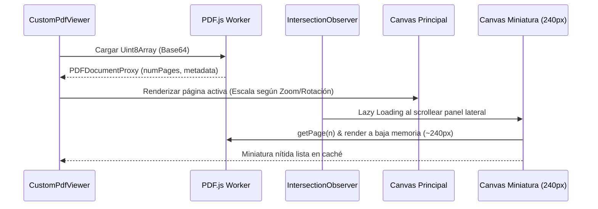

# Sistema de Gestión Documental y Suite de Vistas Previas

> Documentación técnica integral de la arquitectura, componentes, parsers binarios en cliente, diseño temático (Modo Claro/Oscuro), atajos de teclado, gestos de zoom y pantalla completa nativa para la plataforma **Clerkship**.

---

## 1. Resumen Ejecutivo

La plataforma cuenta con un sistema completo de **Gestión Documental y Vistas Previas Propias en Pestaña Completa** (*In-Tab Previews*). Esto permite a los usuarios previsualizar de forma nativa e interactiva documentos en formatos **PDF, Word (.docx/.doc), Excel (.xlsx/.xls/.csv), PowerPoint (.pptx), Imágenes y Código/Texto Plano**, sin necesidad de descargar el archivo ni abrir ventanas emergentes externas, respetando en todo momento la barra lateral (*Sidebar*) y el estado del Dashboard.

---

## 2. Arquitectura General (Backend + Frontend)

```mermaid
graph TD
    subgraph Frontend [Frontend React + TypeScript + Canvas]
        DP[DashboardPage / Lista y Carpetas 3D] --> DPV[DocumentPreviewView / Pestaña Completa]
        DPV --> CPV[CustomPdfViewer / PDF.js Canvas]
        DPV --> FP[fileParsers.ts / mammoth, xlsx, jszip]
        DPV --> IV[Visor de Imágenes / Zoom y Rotación]
        DPV --> TV[Visor de Código y Texto Plano]
    end

    subgraph Backend [Backend Flask API]
        R_DOC[/api/documentos] --> PG[(PostgreSQL / Supabase)]
        R_DOC --> MGO[(MongoDB Atlas)]
    end

    DPV <-->|GET /api/documentos/:id| R_DOC
    PG -.->|Jerarquía y carpetas| R_DOC
    MGO -.->|Base64 y contenido binario| R_DOC
```

---

## 3. Arquitectura del Backend (`flask-api`)

El almacenamiento de archivos adopta un **modelo híbrido de base de datos**:

1. **PostgreSQL (Supabase)**: Almacena la estructura relacional y metadatos de las carpetas (`document_folders`), tales como el nombre, color, fecha de creación, usuario propietario (`owner_user_id`) y carpeta padre (`parent_folder_id`).
2. **MongoDB Atlas**: Almacena los documentos (`documents`) en formato binario codificado en Base64, permitiendo almacenar archivos de hasta ~11 MB sin necesidad de configurar buckets S3 externos para el entorno de desarrollo.

### Endpoints REST (`pruebas/back/flask-api/app/routes/documentos.py`)

| Método | Ruta | Descripción |
|---|---|---|
| `GET` | `/api/documentos/carpetas` | Lista todas las carpetas del usuario con conteo de archivos y peso total (agregación en Mongo). |
| `POST` | `/api/documentos/carpetas` | Crea una nueva carpeta en PostgreSQL con nombre, color y carpeta padre opcional. |
| `PATCH` | `/api/documentos/carpetas/<id>` | Actualiza nombre, color o mueve la carpeta a otra carpeta padre. |
| `DELETE`| `/api/documentos/carpetas/<id>` | Elimina la carpeta en PostgreSQL y en cascada todos sus documentos en MongoDB. |
| `GET` | `/api/documentos/documentos` | Lista documentos (metadatos sin el payload base64 para máxima velocidad). |
| `POST` | `/api/documentos/documentos` | Sube un nuevo documento (guarda base64, tamaño, mime-type y folder_id en Mongo). |
| `GET` | `/api/documentos/documentos/<id>`| Obtiene el documento completo **incluyendo el base64** para renderizar la vista previa. |
| `PATCH`| `/api/documentos/documentos/<id>`| Renombra el documento o lo mueve de carpeta. |
| `DELETE`| `/api/documentos/documentos/<id>`| Elimina el documento de MongoDB Atlas. |
| `GET` | `/api/documentos/documentos/recientes` | Obtiene los últimos documentos subidos por el usuario. |

#### Código relevante del Backend (`documentos.py`):
```python
@documentos_bp.get("/documentos/<document_id>")
@jwt_required()
def obtener_documento(document_id):
    user = get_current_user()
    try:
        oid = ObjectId(document_id)
    except Exception:
        return jsonify({"error": "ID de documento inválido"}), 400

    doc = get_mongo_db().documents.find_one({"_id": oid, "owner_user_id": str(user.id)})
    if not doc:
        return jsonify({"error": "Documento no encontrado"}), 404

    return jsonify({"document": _document_dict(doc, include_data=True)}), 200
```

---

## 4. Arquitectura del Frontend (`frontend/src/`)

### 4.1. Componentes Principales

- `DocumentPreviewView.tsx`: Contenedor principal de la vista previa que ocupa el 100% de la pestaña del Dashboard, manteniendo la barra superior con botón "Volver", badge temático, nombre del archivo, zoom y pantalla completa nativa.
- `CustomPdfViewer.tsx`: Visor propio de PDF desarrollado con `pdfjs-dist` y renderizado sobre lienzos `<canvas>` HTML5.
- `fileParsers.ts`: Módulo de utilidades con parsers en cliente para Word (`mammoth`), Excel (`xlsx`) y PowerPoint (`jszip`).
- `DashboardPage.tsx`: Vista de inicio con carpetas tridimensionales interactivas (efecto solapa 3D) y tarjetas de documentos con insignias coloreadas por tipo de archivo.

---

## 5. Parsers y Visores Especializados

### 5.1. Visor Propio de PDF (`CustomPdfViewer.tsx`)

A diferencia de los visores predeterminados de los navegadores (que abren interfaces genéricas o iframes bloqueados), este visor propio controla el ciclo de vida completo del renderizado de páginas:



- **Renderizado Principal**: Dibuja cada página sobre un canvas ajustado dinámicamente según el nivel de zoom (`50%` a `300%`) y rotación (`0°`, `90°`, `180°`, `270°`).
- **Miniaturas Laterales de Alta Definición (`PdfThumbnailCard`)**:
  - Utiliza `IntersectionObserver` con margen `rootMargin: '200px'` para **no procesar páginas fuera de la pantalla** (*lazy loading*).
  - Dibuja a una resolución nítida de `240px` de ancho con antialiasing nativo y suavizado de tipografías.
  - Consumo de memoria ultraligero (<25 KB por miniatura) con caché de canvas persistente.

### 5.2. Visor de Word (`fileParsers.ts` + `mammoth`)

Convierte archivos `.docx` en HTML limpio y semántico directamente en el navegador del usuario:
- Extrae encabezados `h1`, `h2`, `h3`, negritas, cursivas, listas ordenadas y desordenadas, citas en bloque y tablas con bordes estilizados.
- Se presenta sobre una **hoja blanca A4** con sombreado corporativo, reproduciendo la apariencia real de un procesador de texto.

```typescript
export async function parseDocxFile(base64Data: string): Promise<ParsedDocxResult> {
  const arrayBuffer = base64ToArrayBuffer(base64Data);
  const result = await mammoth.convertToHtml({ arrayBuffer });
  return { html: result.value, messages: result.messages };
}
```

### 5.3. Visor de Excel (`fileParsers.ts` + `xlsx`)

Lee libros de trabajo de hojas de cálculo (`.xlsx`, `.xls`, `.csv`):
- Extrae la lista de hojas (`sheetNames`).
- Permite alternar entre pestañas de hojas en la parte inferior.
- Muestra una barra de fórmulas superior con indicador `fx` y filas totales detectadas.
- Renderiza una matriz tabular con cabeceras de columnas alfabéticas (`A`, `B`, `C`...) y números de fila (`1`, `2`, `3`...).

### 5.4. Visor de PowerPoint (`fileParsers.ts` + `jszip`)

Lee archivos de presentación `.pptx`:
- Descomprime el archivo `.pptx` y analiza los archivos XML `ppt/slides/slide*.xml`.
- Extrae títulos de diapositiva (`<p:sp>` con texto destacado) y párrafos con viñetas.
- Proporciona un panel lateral con miniaturas de diapositivas y controles para avanzar y retroceder con el teclado o botones.

---

## 6. Navegación, Atajos de Teclado y Gestos

Tanto en `CustomPdfViewer.tsx` como en `DocumentPreviewView.tsx` se implementaron manejadores de eventos globales para enriquecer la experiencia de usuario:

### 6.1. Atajos de Zoom
- `Ctrl` + `+` o `Ctrl` + `=`: Aumenta el zoom (+15% / +20%).
- `Ctrl` + `-`: Reduce el zoom (-15% / -20%).
- `Ctrl` + `0`: Restablece el zoom al 100%.
- `Ctrl` + `Rueda del ratón`: Zoom continuo (listener con `{ passive: false }` que intercepta `e.preventDefault()`).
- **Gesto de pellizco en Touchpad**: Zoom táctil multitáctil nativo.

### 6.2. Navegación por Teclado
- **Avanzar**: Flecha Derecha (`➡️`), Flecha Abajo (`⬇️`), tecla `PageDown` o `Espacio`.
- **Retroceder**: Flecha Izquierda (`⬅️`), Flecha Arriba (`⬆️`) o `PageUp`.
- **Inicio / Fin**: Teclas `Inicio` (`Home`) y `Fin` (`End`).

### 6.3. Pantalla Completa Real (F11 API)
- El botón de pantalla completa invoca `element.requestFullscreen()` / `document.exitFullscreen()`.
- Sincronizado con eventos `fullscreenchange` y compatible con la tecla `F11` y `Esc`.

---

## 7. Modo Claro y Modo Oscuro

Se aplicó un diseño semántico estricto en `dashboard.css` y `theme.css`:

1. **Interfaz Propia Adaptable**:
   - **Modo Claro**: Barras de herramientas en blanco (`#FFFFFF`), fondos de escenario en gris claro neutro (`#E2E8F0`), textos y controles en slate oscuro (`#0F172A`).
   - **Modo Oscuro**: Barras de herramientas en azul pizarra profundo (`#1E293B`), paneles en `#0B1120`, textos en slate claro (`#F8FAFC`).
2. **Preservación Total de Documentos**:
   - Las hojas de **PDF**, las páginas A4 de **Word**, las diapositivas de **PowerPoint** y las celdas de **Excel** conservan su lienzo blanco original con tipografía de alto contraste en ambos modos, evitando inversiones o distorsiones de color en el contenido del usuario.
3. **Pantalla de Carga Unificada**:
   - Al cargar o procesar archivos, la pantalla completa adopta un fondo blanco uniforme en modo claro (y oscuro en modo oscuro), sin tarjetas artificiales, con spinner centrado y texto de estado.
4. **Solapas 3D de Carpetas**:
   - Títulos de carpetas en blanco con un **95% de opacidad** (`opacity: 0.95`).
   - Información de archivos y tamaño en blanco con un **85% de opacidad** (`opacity: 0.85`).

---

## 8. Verificación y Calidad

- **Compilación Frontend**: Validado con `tsc -b && vite build` (cero errores de TypeScript y bundling limpio en 1.74s).
- **Control de Versiones**: Respetando las directivas del proyecto (sin commits ni pushes no autorizados).
